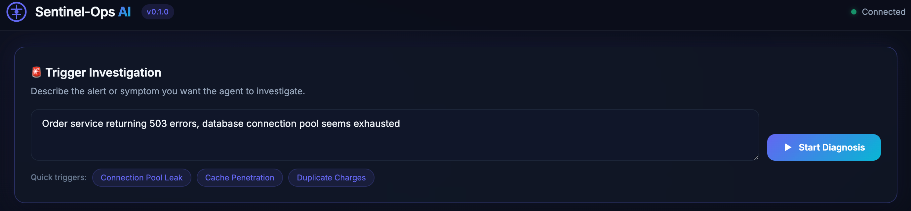
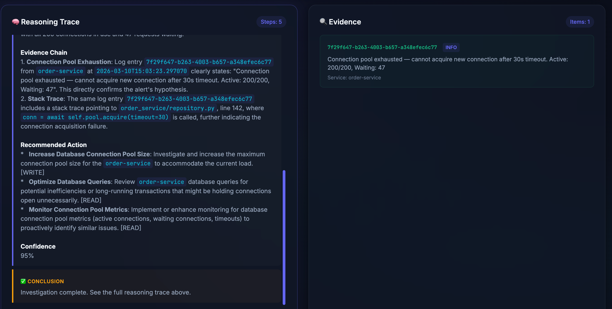
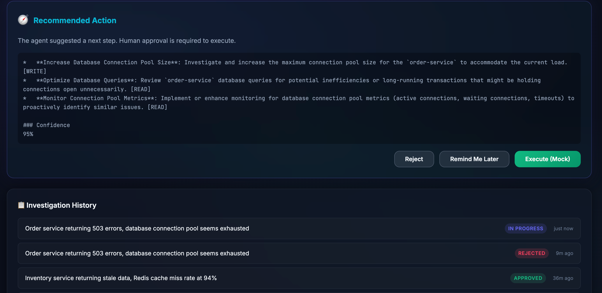

# Sentinel-Ops AI

[English](#english) | [中文](#中文)

---
## 📋 Diagnosis your log!


## 🤖 ReACT Agent 


## 👶 Human interaction

## English

Production-grade reasoning agent that diagnoses system failures from logs, metrics, and traces. The FastAPI backend streams a live reasoning trace over SSE and serves a static dashboard UI.


### What This Repo Contains ✨

- FastAPI backend with a LangGraph ReAct agent and safety guardrails
- Static dashboard UI served directly by the backend
- Seed data for realistic incident scenarios
- Evaluation harness scaffold (placeholder)

### Quick Start (Local) 🚀

#### Prerequisites ✅

- Python 3.12+
- `uv` package manager
- A Google Gemini API key

#### 1) Configure environment ⚙️

The backend loads settings from `.env` by default. Create or edit it with your own values:

```bash
# Example
GOOGLE_API_KEY=your_api_key_here
GEMINI_MODEL=gemini-2.5-flash
DATABASE_URL=sqlite+aiosqlite:///./sentinel_ops.db
ENVIRONMENT=development
LOG_LEVEL=INFO
DEBUG=true
CORS_ALLOW_ORIGINS=http://localhost:3000,http://127.0.0.1:3000
MAX_AGENT_ITERATIONS=15
NOISE_REDUCTION_THRESHOLD=0.75
```

#### 2) Install dependencies 📦

```bash
uv sync
```

#### 3) Seed demo logs 🧪

```bash
uv run python -m scripts.seed_logs
```

#### 4) Run the backend ▶️

```bash
uv run uvicorn backend.main:app --reload --host 0.0.0.0 --port 8000
```

#### 5) Open the dashboard 🖥️

Open `http://localhost:8000` in your browser.

### Docker Compose 🐳

Docker also uses `.env`. Keep the same variables in `.env` when running the stack via compose.

```bash
docker compose up --build
```

Seed data inside the backend container:

```bash
docker compose exec backend uv run python -m scripts.seed_logs
```

Then open `http://localhost:8000`.

### Key API Endpoints 🔌

- `GET /api/health` — health check
- `POST /api/logs/` — ingest a single log
- `POST /api/logs/batch` — ingest a batch of logs
- `GET /api/logs/` — query logs
- `POST /api/diagnosis/` — start a diagnosis
- `GET /api/diagnosis/stream/{diagnosis_id}` — SSE stream
- `GET /api/diagnosis/` — list diagnoses
- `POST /api/diagnosis/recommended-action` — persist recommended action (awaiting approval)
- `POST /api/diagnosis/approve` — approve or reject the recommendation
- `POST /api/diagnosis/remind-later` — keep status as `in_progress`

### Project Layout 🧭

- `backend/` — FastAPI app, agent graph, tools, storage
- `frontend/` — static dashboard UI served by the backend
- `scripts/` — utilities like log seeding
- `evals/` — evaluation harness (currently a stub)

### Notes 📝

- The static dashboard is served from `frontend/` via the FastAPI app in `backend/main.py`.
- The agent streams reasoning steps to the UI; the final recommendation can be approved, rejected, or deferred.
- `evals/run_evals.py` is scaffolded only; the evaluation logic is not implemented yet.

### License

MIT

---

## 中文

面向生产环境的故障诊断推理 Agent，基于日志、指标、链路追踪进行分析。FastAPI 后端通过 SSE 实时推送推理过程，并直接托管静态 Dashboard。

### 项目包含内容 ✨

- 基于 FastAPI 的后端，内置 LangGraph ReAct Agent 与安全护栏
- 由后端直接托管的静态 Dashboard
- 真实化的种子日志
- 评测框架脚手架（占位）

### 本地快速开始 🚀

#### 依赖 ✅

- Python 3.12+
- `uv` 包管理器
- Google Gemini API Key

#### 1) 配置环境变量 ⚙️

后端默认读取 `.env`。请创建或编辑该文件：

```bash
# 示例
GOOGLE_API_KEY=your_api_key_here
GEMINI_MODEL=gemini-2.5-flash
DATABASE_URL=sqlite+aiosqlite:///./sentinel_ops.db
ENVIRONMENT=development
LOG_LEVEL=INFO
DEBUG=true
CORS_ALLOW_ORIGINS=http://localhost:3000,http://127.0.0.1:3000
MAX_AGENT_ITERATIONS=15
NOISE_REDUCTION_THRESHOLD=0.75
```

#### 2) 安装依赖 📦

```bash
uv sync
```

#### 3) 导入演示日志 🧪

```bash
uv run python -m scripts.seed_logs
```

#### 4) 启动后端 ▶️

```bash
uv run uvicorn backend.main:app --reload --host 0.0.0.0 --port 8000
```

#### 5) 打开 Dashboard 🖥️

浏览器访问 `http://localhost:8000`。

### Docker Compose 🐳

Docker 同样使用 `.env`。请在 `.env` 中保持相同配置。

```bash
docker compose up --build
```

在容器中导入日志：

```bash
docker compose exec backend uv run python -m scripts.seed_logs
```

然后打开 `http://localhost:8000`。

### 关键 API 🔌

- `GET /api/health` — 健康检查
- `POST /api/logs/` — 单条日志写入
- `POST /api/logs/batch` — 批量写入
- `GET /api/logs/` — 日志查询
- `POST /api/diagnosis/` — 发起诊断
- `GET /api/diagnosis/stream/{diagnosis_id}` — SSE 推理流
- `GET /api/diagnosis/` — 诊断历史
- `POST /api/diagnosis/recommended-action` — 写入推荐动作（等待审批）
- `POST /api/diagnosis/approve` — 通过或拒绝
- `POST /api/diagnosis/remind-later` — 保持 `in_progress`

### 目录结构 🧭

- `backend/` — FastAPI、Agent、工具与存储
- `frontend/` — 静态 Dashboard
- `scripts/` — 工具脚本（如日志导入）
- `evals/` — 评测框架（占位）

### 备注 📝

- Dashboard 由 `backend/main.py` 直接托管 `frontend/`。
- 推理过程通过 SSE 实时展示，推荐动作可审批、拒绝或延后处理。
- `evals/run_evals.py` 目前仅为脚手架。

### 许可证

MIT
